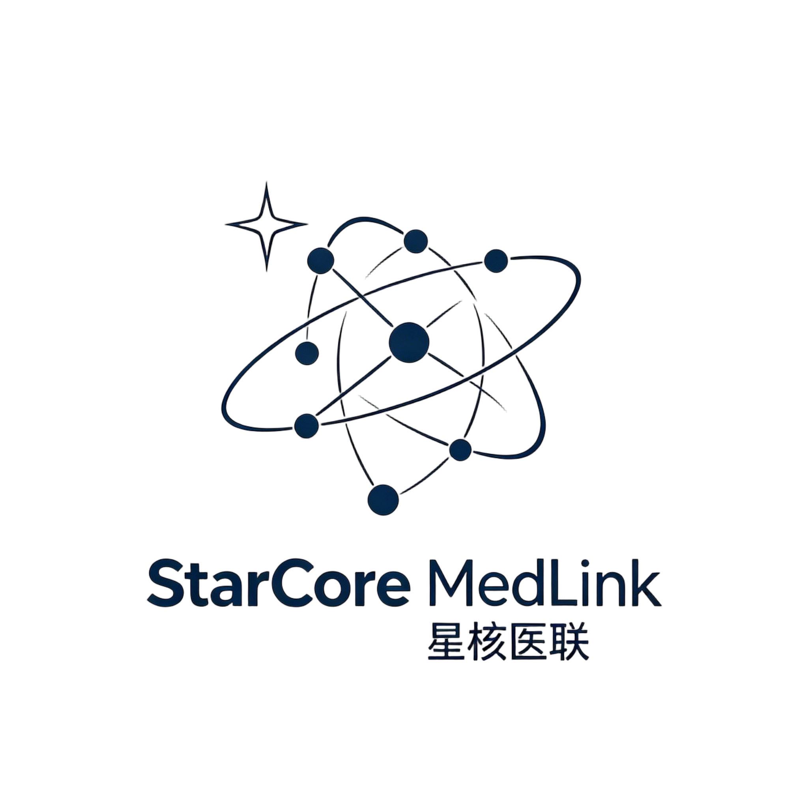
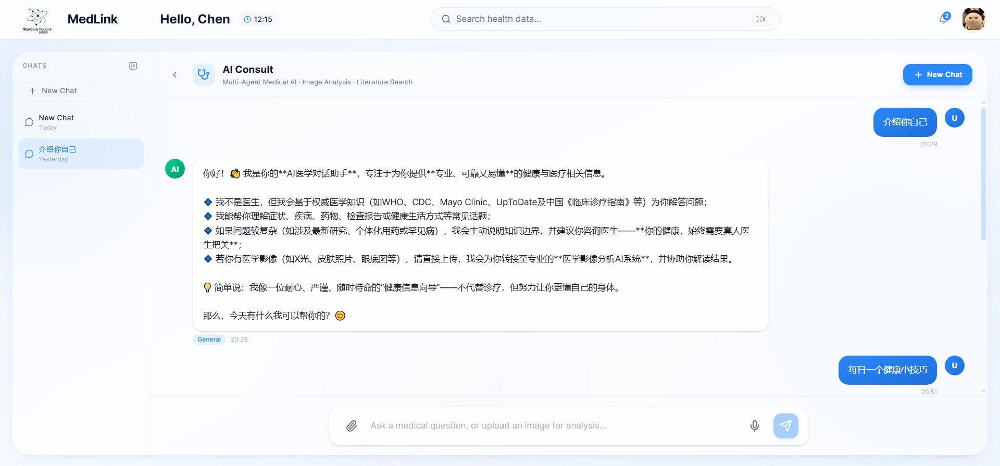
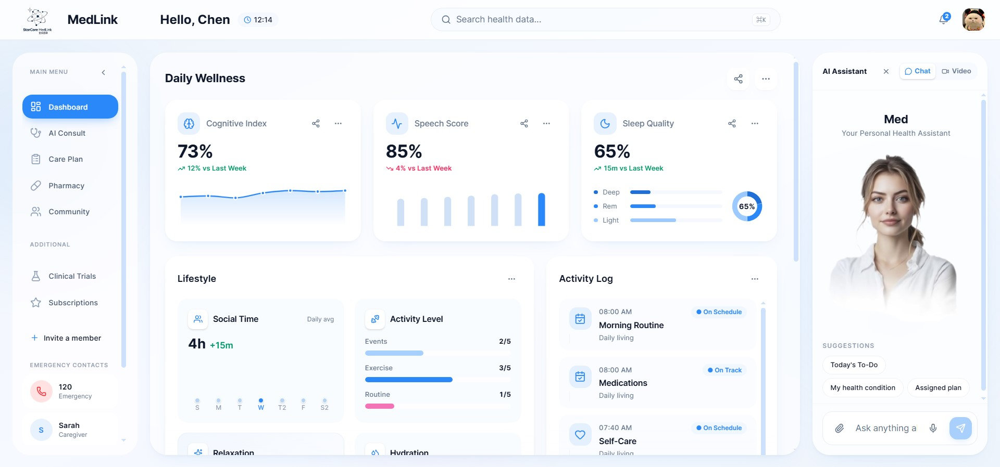

<div align="center">



<h1>StarCore MedLink</h1>

**星核互联 · 个人健康 AI 伙伴**

多 Agent 协作的个性化医学 AI 系统 —— 记住你的完整健康历史，在任何医学咨询场景下提供"结合个人情况"的回答。


[](./LICENSE)


</div>

---

## 目录

- [概述](#概述)
- [界面预览](#界面预览)
- [系统架构](#系统架构)
- [核心功能](#核心功能)
- [技术栈](#技术栈)
- [快速开始](#快速开始)
- [使用说明](#使用说明)
- [项目结构](#项目结构)
- [设计文档](#设计文档)
- [许可证与致谢](#许可证与致谢)

---

## 概述

**StarCore MedLink** 是一个"个人健康 AI 伙伴"——不是医生，不是搜索引擎，而是记住你完整健康历史的智能管家。

与通用 AI Chatbot 的根本区别在于**个性化层**：所有 AI 回答的基础不是通用知识，而是用户的个人健康记忆。

### 系统三大记忆层

| 记忆层 | 内容 | 作用 |
|--------|------|------|
| **个人记忆** | 健康档案、历史指标、用药记录、过敏史 | 所有回答的个性化基础 |
| **医学记忆** | 文献库、临床指南、实时搜索 | 让每句话有据可查 |
| **系统记忆** | 功能说明、操作指南 | 知道自己能做什么、不能做什么 |

### Agent 体系

| Agent | 职责 |
|-------|------|
| **AI 管家（决策中枢）** | 意图识别 → 按需检索个人健康事实 → 路由到专业 Agent |
| **Conversation Agent** | 通用医学对话、健康咨询（注入个人健康上下文） |
| **RAG Agent** | 医学文献检索 + 个人健康事实语义检索，混合重排序 |
| **Web Search Agent** | 实时网络搜索，RAG 置信度不足时自动接管 |
| **Brain Tumor Agent** | 脑肿瘤 MRI U-Net 分割，输出肿瘤占比 |
| **Chest X-Ray Agent** | COVID-19 胸部 X 光 DenseNet121 分类 |
| **Skin Lesion Agent** | 皮肤病变 U-Net 分割 |

---

## 界面预览

### AI Consult — 多 Agent 医学咨询



### Dashboard — 个人健康仪表盘



---

## 系统架构

```
Entry
  │
  ▼
analyze_input          ← 安全检查 + 图像分类（视觉 LLM）
  │
  ▼
enrich_context         ← 健康意图检测 → 语义检索 personal_health_facts
  │
  ▼
route_to_agent         ← 决策 LLM：基于意图 + 上下文选择 Agent
  │
  ├── CONVERSATION_AGENT    ← 注入个人健康上下文
  ├── RAG_AGENT             ← Qdrant 混合检索 + Cross-Encoder 重排
  ├── WEB_SEARCH_AGENT      ← Tavily 实时搜索
  ├── BRAIN_TUMOR_AGENT     ← U-Net MRI 分割
  ├── CHEST_XRAY_AGENT      ← DenseNet121 X 光分类
  └── SKIN_LESION_AGENT     ← U-Net 皮肤病变分割
  │
  ▼
apply_guardrails       ← 输出审查
  │
  ▼
END
```


---

## 核心功能

- **个性化健康咨询** — 按需语义检索个人健康事实，非全量注入。闲聊不触发健康记忆，医学问题自动关联病史
- **多 Agent 协作** — LangGraph 状态图编排 6 个专业 Agent，置信度路由 + Agent 间自动交接
- **高级 RAG 检索** — Docling 文档解析 + Qdrant Dense + BM25 混合检索 + Cross-Encoder 重排序 + LLM Query Expansion
- **医学影像分析** — 三类 CV 模型实际推理：脑肿瘤 MRI 分割、胸部 X 光分类、皮肤病变分割
- **个人健康档案（PHR）** — 健康资料 + 日常指标管理 + 健康事实自动索引至 Qdrant
- **网络搜索** — Tavily 实时搜索，查询词关联病史关键词
- **语音交互** — Eleven Labs STT/TTS
- **安全护栏** — 输入/输出 Guardrails

---

## 技术栈

| 层级 | 技术 |
|------|------|
| **后端框架** | FastAPI + Uvicorn |
| **Agent 编排** | LangGraph + LangChain（SQLite checkpoint 持久化） |
| **前端** | React 19 + TypeScript + Vite + Tailwind CSS |
| **LLM** | DashScope Qwen / OpenAI / DeepSeek（可切换） |
| **视觉模型** | Qwen-VL / GPT-4o |
| **向量数据库** | Qdrant（本地模式，Dense + BM25 混合检索） |
| **嵌入模型** | DashScope text-embedding-v3 |
| **文档解析** | Docling |
| **重排序** | HuggingFace Cross-Encoder (`ms-marco-TinyBERT-L-6`) |
| **语音** | Eleven Labs API |
| **网络搜索** | Tavily Search API |
| **CV 模型** | PyTorch + torchvision（U-Net ×2, DenseNet121） |

---

## 快速开始

### 环境要求

- Python 3.11+
- Node.js 20+
- ffmpeg（语音功能需要）

### 1. 克隆项目

```bash
git clone <your-repo-url>
cd StarCore-MedLink
```

### 2. 后端安装

```bash
python -m venv .venv
source .venv/bin/activate  # Linux/Mac
# .venv\Scripts\activate   # Windows

pip install -r requirements.txt
```

### 3. 配置环境变量

```bash
cp .env.example .env
```

编辑 `.env`，填入 API Key：

```bash
# 必填
LLM_API_KEY=your-api-key
LLM_MODEL=qwen-plus
VISION_MODEL=qwen-vl-plus

# 可选
ELEVEN_LABS_API_KEY=       # 语音功能
TAVILY_API_KEY=             # 网络搜索
HUGGINGFACE_TOKEN=          # Cross-Encoder 重排序
```

> 默认使用阿里云 DashScope（Qwen 系列），切换到其他 LLM 只需修改 `LLM_API_KEY`、`LLM_BASE_URL` 和 `LLM_MODEL`。

### 4. 前端安装

```bash
cd frontend
npm install
npm run build
cd ..
```

### 5. 启动应用

```bash
python app.py
```

访问 [http://localhost:8080](http://localhost:8080)

### 6. （可选）注入 RAG 数据

```bash
python ingest_rag_data.py --file ./data/raw/your-document.pdf
python ingest_rag_data.py --dir ./data/raw
```

---

## 使用说明

- **AI 咨询** — 在聊天界面输入医学问题，系统自动识别意图、检索个人健康事实、路由到合适的 Agent
- **影像分析** — 选择图片 → 输入描述 → 点发送，CV Agent 进行实际模型推理
- **健康档案** — 在 Dashboard 填写个人资料和日常指标，数据自动索引为可检索的健康事实
- **语音输入** — 按住麦克风按钮录音，自动转文字后发送

> 首次运行需下载 CV 模型权重和 Cross-Encoder 模型，可能较慢。

---

## 项目结构

```
StarCore-MedLink/
├── agents/                         # 多 Agent 系统
│   ├── agent_decision.py           # Agent 编排、意图路由、enrich_context
│   ├── fact_indexer.py             # 个人健康事实 Qdrant 索引与检索
│   ├── guardrails/                 # 输入输出安全护栏
│   ├── rag_agent/                  # RAG 检索 Agent（Qdrant + 重排）
│   ├── web_search_processor_agent/ # 网络搜索 Agent
│   └── image_analysis_agent/      # 医学影像分析（3 个 CV Agent）
│       ├── brain_tumor_agent/      # U-Net 脑肿瘤分割
│       ├── chest_xray_agent/       # DenseNet121 X 光分类
│       └── skin_lesion_agent/      # U-Net 皮肤病变分割
├── utils/                          # 工具模块
│   └── dashscope_embeddings.py     # DashScope 嵌入模型封装
├── frontend/                       # React SPA 前端
│   └── src/components/             # ChatPage, Dashboard, HealthProfile 等
├── data/                           # 数据库与向量存储
│   ├── raw/                        # RAG 待注入文档
│   └── qdrant_db/                  # Qdrant 本地持久化
├── app.py                          # FastAPI 入口
├── config.py                       # 配置中心
├── health_db.py                    # 个人健康档案（PHR）SQLite 存储
├── ingest_rag_data.py              # RAG 数据注入 CLI
├── logging_config.py               # 日志配置
├── Dockerfile                      # Docker 部署
├── requirements.txt                # Python 依赖
├── assets/                         # 截图与架构图
└── sample_images/                  # 测试用医学影像
```

---

## 许可证与致谢

本项目基于 [MIT License](LICENSE)。

Forked from [souvikmajumder26/Multi-Agent-Medical-Assistant](https://github.com/souvikmajumder26/Multi-Agent-Medical-Assistant)，在此基础上进行了以下主要改动：

- 前端从 HTML/CSS/JS 重构为 **React + TypeScript + Vite + Tailwind CSS** SPA
- LLM 从 Azure OpenAI 切换为 **DashScope Qwen 系列**（可配置切换）
- 新增 **个人健康事实语义检索**（Qdrant `personal_health_facts` collection + `enrich_context` 节点）
- 新增 **个人健康档案（PHR）** 系统，支持健康资料和日常指标管理
- Brain Tumor / Skin Lesion Agent 从占位文本改为**实际 CV 模型推理**
- 新增 **FactIndexer**：健康事实自动 embedding → Qdrant 索引
- 升级 LangChain/LangGraph 至 1.x 版本
